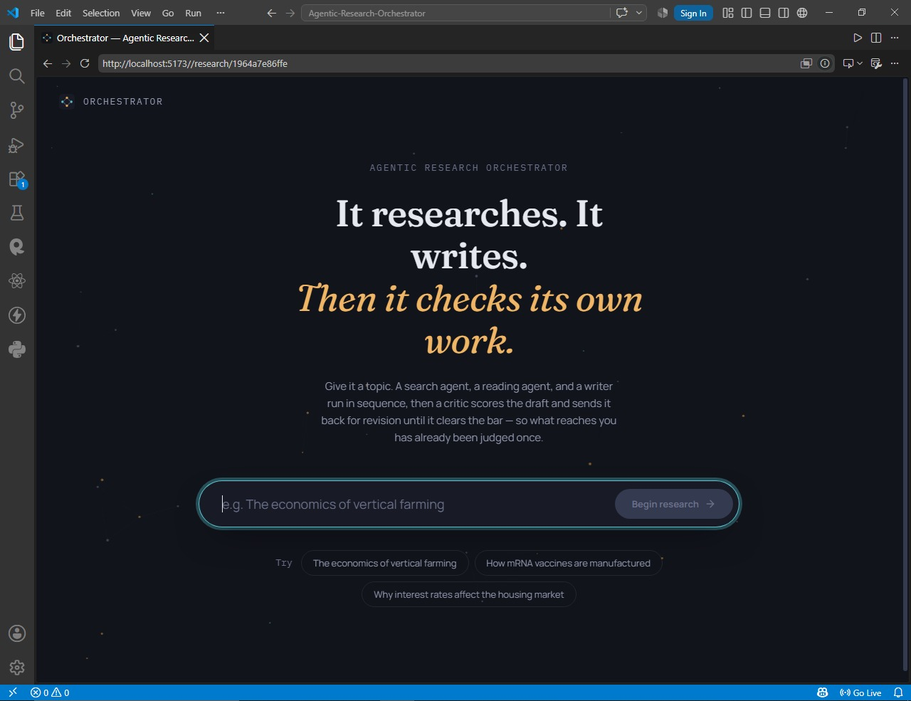

<div align="center">

# 🧭 Agentic Research Orchestrator

### A self-correcting, multi-agent research pipeline that searches, reads, writes, and grades its own work

*It researches. It writes. Then it checks its own work.*

[](https://www.python.org/)
[](https://fastapi.tiangolo.com/)
[](https://www.langchain.com/)
[](https://www.langchain.com/langgraph)
[](https://mistral.ai/)
[](https://tavily.com/)
[](https://react.dev/)
[](https://www.typescriptlang.org/)
[](https://vite.dev/)
[](https://www.framer.com/motion/)

</div>

---

## Overview

**Agentic Research Orchestrator (ARO)** is a full-stack, self-hosted research automation system. Give it a topic; it runs an autonomous, multi-agent pipeline that **searches the live web, reads and extracts from the most credible sources it finds, drafts a structured Markdown report, critiques that report against an eight-dimension editorial rubric, and iteratively refines it until the report clears a configurable quality bar** — all before typesetting a downloadable, publication-styled PDF.

Where a typical LLM wrapper makes a single generation call and hopes for the best, ARO is architected as a **generator–critic loop**: a dedicated evaluator agent scores every draft and hands back actionable, structured critique, and a dedicated refinement chain revises the draft against that critique — using *only* the originally retrieved research material, never inventing facts to paper over a gap. The result is a report that has already been reviewed once before a human ever sees it.

The backend is a fully async **FastAPI** service orchestrating **LangChain/LangGraph ReAct agents** against **Mistral**, hardened with an explicit retry/backoff layer for transient API failures. The frontend is a **React 19 + TypeScript** single-page app that visualizes the pipeline live — a five-stage progress instrument, an ambient activity feed, an animated score gauge, and a full iteration timeline — before presenting the finished report on a distinct "paper" surface.

---

## Table of Contents

- [Overview](#overview)
- [Features](#features)
- [Architecture](#architecture)
- [Design Philosophy](#design-philosophy)
- [Screenshots](#screenshots)
- [Tech Stack](#tech-stack)
- [Project Structure](#project-structure)
- [API Reference](#api-reference)
- [Getting Started](#getting-started)
- [Configuration](#configuration)
- [Known Limitations](#known-limitations)
- [Roadmap Ideas](#roadmap-ideas)
- [Contributing](#contributing)
- [License](#license)

---

## Features

**Retrieval**
- **Search agent** — a LangGraph-compiled ReAct loop (`langchain.agents.create_agent`) bound to a Tavily-backed `web_search` tool, free to issue multiple queries across different angles of a topic before deciding it has adequate coverage.
- **Scrape agent** — a second ReAct loop bound to a `requests` + BeautifulSoup `scrape` tool, which reads full page content for the most promising URLs the search stage surfaced, stripping script/nav/header/footer noise and degrading gracefully (never raising) on dead links or unsupported content types.
- Both agents are capped by a configurable `agent_recursion_limit`, bounding tool-call turns so a stubborn topic can't spiral into an unbounded, rate-limit-inducing loop.

**Generation & self-review**
- **Two-pass writer** — an initial `writer()` chain drafts a full report (Executive Summary → Introduction → Background → Findings → Analysis → Insights → Limitations → Implications → Conclusion → References) strictly from the retrieved research material, and a separate `refine_writer()` chain revises only what the critique flags, preserving everything else.
- **Structured critic** — a `checker()` chain scores every draft across **8 weighted dimensions** (Research Quality, Factual Reliability, Structure & Organization, Depth & Analysis, Clarity & Readability, Professionalism, Evidence & Sources, Overall Effectiveness), returning a full Markdown assessment *plus* a trailing machine-readable JSON line for programmatic parsing — with a regex fallback parser in case model output drifts from the requested format.
- **Bounded refinement loop** — the orchestrator loops writer ↔ checker until the score clears `QUALITY_SCORE_THRESHOLD` or `MAX_REFINE_ITERATIONS` is exhausted, so the pipeline is guaranteed to terminate.

**Reliability**
- **Transient-failure resilience layer** — every LLM call is wrapped in `tenacity`-driven exponential backoff with jitter, specifically catching HTTP `429/500/502/503/504` responses that LangChain's own client-level retry does not cover, and honoring the API's `Retry-After` header when present instead of guessing a wait time.
- **Typed exception hierarchy** — `SearchAgentError`, `ScrapeAgentError`, `ReportGenerationError`, `ReportEvaluationError`, and `PDFGenerationError` all map to distinct FastAPI exception handlers, so API consumers get a structured `{error, detail}` contract instead of a stack trace.
- **Best-effort PDF rendering** — a PDF failure is caught, logged, and does not fail the overall research request; the Markdown report and evaluation are always returned regardless.

**Delivery**
- **Publication-styled PDF export** — the Markdown report and full evaluator critique are converted to styled HTML and rendered with `xhtml2pdf` (pure-Python, ReportLab-backed — no system-level `wkhtmltopdf`/Pango/Cairo dependency), complete with a cover page, quality-score badge, and paginated footer.
- **Shareable, refresh-safe reports** — the frontend syncs the generated `report_id` into the URL query string, so a finished report can be reloaded or shared as a link and fetched directly via `GET /api/research/{id}` without re-running the pipeline.
- **Fully documented REST surface** — every endpoint is auto-documented through FastAPI's OpenAPI 3.1 schema, browsable at `/docs`.

**Interface**
- **Live pipeline visualization** — a five-stage progress instrument (**Search → Read → Draft → Evaluate → Finalize**) synced to an ambient activity feed of micro-status lines, animated with Framer Motion.
- **Iteration transparency** — every writer ↔ checker round-trip is retained in `iteration_history` and rendered as a timeline, so it's visible exactly how many refinement passes a report took and how its score moved.
- **Animated score gauge + inline critique** — the evaluator's full breakdown (score table, strengths, critical issues, prioritized recommendations) is rendered next to the finished report, not discarded once it clears the gate.

---

## Architecture

```
   Topic
     │
     ▼
┌───────────────────────┐        ┌────────────────────┐
│     search_agent        │ ────▶ │   web_search tool    │  Tavily · called N× until the
│  LangGraph ReAct loop   │ ◀──── │                      │  agent judges coverage sufficient
└───────────┬─────────────┘        └────────────────────┘
            │ ranked findings + source URLs
            ▼
┌───────────────────────┐        ┌────────────────────┐
│     scrape_agent        │ ────▶ │      scrape tool      │  BeautifulSoup · reads up to
│  LangGraph ReAct loop   │ ◀──── │                      │  2 × SEARCH_MAX_RESULTS pages
└───────────┬─────────────┘        └────────────────────┘
            │ extracted facts + citations
            ▼
┌───────────────────────┐
│        writer()          │  Mistral · temperature 0.4 · first draft, Markdown
└───────────┬─────────────┘
            ▼
┌───────────────────────┐
│        checker()         │◀────────────────────────────────┐
│  8-axis rubric → /100    │  Mistral · temperature 0.0        │
└───────────┬─────────────┘                                   │
            │                                                  │
    score ≥ QUALITY_SCORE_THRESHOLD?  ── no, iterations left ──┤
            │                                          ┌───────┴────────┐
           yes  (or MAX_REFINE_ITERATIONS reached)      │ refine_writer() │
            │                                          │  Mistral · 0.4  │
            ▼                                          └────────┬────────┘
┌───────────────────────┐                                        │
│  generate_report_pdf     │◀───────────────────────────────────┘
│  Markdown → HTML → PDF   │  xhtml2pdf (pure-Python / ReportLab)
└───────────────────────┘
```

Every LLM invocation in this diagram — `search_agent`, `scrape_agent`, `writer`, `checker`, and `refine_writer` — is routed through `ainvoke_with_retry()`, the resilience layer described above, rather than called directly. Pipeline orchestration itself (`pipelines/orchestrator.py`) has no FastAPI-specific code, so it's independently scriptable and testable outside the HTTP layer.

Chat/report metadata is currently held in an **in-process `ReportStore`** (a thread-safe dict keyed by `report_id`); generated PDFs are written to disk under `REPORTS_DIR`. See [Known Limitations](#known-limitations).

---

## Design Philosophy

The frontend isn't a generic dashboard skin — it's built around a deliberate visual concept, captured directly in its design tokens:

> *A research instrument's control room. The shell is a deep, cool "ink" — where the multi-agent pipeline runs and glows. The one thing that leaves the machine is a document: reports render on a warm "paper" surface, a deliberate contrast against the ink shell, so the product's actual output always reads as a physical, finished thing rather than more UI chrome.*

Two accent signals carry meaning rather than decoration: a cool **cyan** for retrieval/evidence-gathering stages, and a warm **amber** for synthesis/judgment and the finished artifact. Typography reinforces the split — **Fraunces** (a display serif) for report and headline moments, **Manrope** for interface text, and **IBM Plex Mono** for status/telemetry lines — assembled with Framer Motion transitions and a reduced-motion-aware animation hook (`useReducedMotion`).

---

## Screenshots

### Landing — the desk before a run
A single input, three worked examples, and a one-line explanation of the mechanism, not just the promise.



### Live pipeline — Search → Read → Draft → Evaluate → Finalize
The five-stage instrument tracks the orchestrator in real time, backed by an ambient feed of granular status lines and an elapsed-time readout.


### Finished report — score, verdict, and the paper itself
An animated score gauge, a "cleared the bar" verdict, one-click PDF download and link copy, and the full evaluator critique sit alongside the rendered report.


### Citations and references, rendered in place
Every source the agents scraped is preserved through to the final report, with a dedicated, cleanly formatted References section.


### API surface & pipeline telemetry
The full REST contract is interactively documented via FastAPI's generated OpenAPI schema; structured logs trace every pipeline stage — iteration, score, and quality level — as it happens.


---

## Tech Stack

### Backend

| Layer                  | Technology                                                                 |
|-------------------------|-----------------------------------------------------------------------------|
| API Framework           | FastAPI (ASGI via Uvicorn, OpenAPI 3.1 auto-docs at `/docs`)               |
| Agent Orchestration     | LangChain `create_agent` — ReAct loops compiled to LangGraph graphs       |
| LLM                     | Mistral, via `langchain-mistralai` (`ChatMistralAI`)                      |
| Web Search Tool         | Tavily API (`tavily-python`)                                              |
| Web Scraping Tool       | `requests` + BeautifulSoup4 — readable-text extraction, tag stripping     |
| Resilience              | `tenacity` — exponential backoff + jitter, `Retry-After`-aware retries    |
| Report → PDF            | `markdown` + `xhtml2pdf` (pure-Python, ReportLab-backed rendering)        |
| Config & Validation     | `pydantic` / `pydantic-settings` — fail-fast env validation               |
| Runtime                 | Python 3.11+                                                               |

### Frontend

| Layer                  | Technology                                                                 |
|-------------------------|-----------------------------------------------------------------------------|
| Framework                | React 19 + TypeScript                                                     |
| Build Tool               | Vite 8                                                                     |
| Motion                   | Framer Motion — staged transitions, animated gauge, ambient background    |
| Markdown Rendering       | `react-markdown` + `remark-gfm` (GitHub-flavored tables, etc.)            |
| Icons                    | `lucide-react`                                                            |
| Typography               | Fraunces · Manrope · IBM Plex Mono (self-hosted via Fontsource)           |
| Linting                  | `oxlint`                                                                  |

---

## Project Structure

```
agentic-research-orchestrator/
├── backend/
│   ├── app/
│   │   ├── main.py                    # FastAPI app factory, CORS, exception handlers
│   │   ├── config.py                  # pydantic-settings, fail-fast env validation
│   │   ├── logger.py                  # structured stdout logging setup
│   │   ├── exceptions.py              # OrchestratorError hierarchy
│   │   ├── schema.py                  # Pydantic request/response models
│   │   ├── store.py                   # thread-safe in-memory ReportStore
│   │   ├── llm.py                     # cached ChatMistralAI client factory
│   │   ├── resilience.py              # ainvoke_with_retry — backoff/jitter layer
│   │   ├── agents.py                  # search_agent / scrape_agent factories
│   │   ├── pipelines/
│   │   │   ├── orchestrator.py        # search → scrape → write → check → refine → pdf
│   │   │   ├── report_generator.py    # writer() and refine_writer() chains
│   │   │   ├── report_checker.py      # checker() chain + evaluation parser
│   │   │   └── generate_pdf.py        # Markdown → styled HTML → PDF
│   │   ├── routes/
│   │   │   ├── research.py            # /api/research endpoints
│   │   │   └── health.py              # liveness/health endpoints
│   │   └── tools/
│   │       ├── websearchtool.py       # Tavily-backed web_search tool
│   │       └── webscraptool.py        # BeautifulSoup-backed scrape tool
│   ├── reports/                       # generated PDFs (REPORTS_DIR)
│   ├── requirements.txt
│   └── .env
└── frontend/
    ├── index.html
    ├── src/
    │   ├── main.tsx / App.tsx
    │   ├── api/client.ts              # fetch wrapper, typed ApiError
    │   ├── hooks/
    │   │   ├── useResearchPipeline.ts # run state machine + shareable URL sync
    │   │   └── useReducedMotion.ts
    │   ├── lib/
    │   │   ├── config.ts              # QUALITY_THRESHOLD from env
    │   │   └── stageScript.ts         # 5-stage timeline choreography
    │   ├── components/
    │   │   ├── input/TopicStage       # landing / topic composer
    │   │   ├── pipeline/              # PipelineDiagram, ActivityFeed, RunningStage
    │   │   ├── report/                # ScoreGauge, ReportPaper, EvaluationPanel,
    │   │   │                          # IterationTimeline, ResultActions, ResultLayout
    │   │   ├── layout/                # AppShell, AmbientBackground
    │   │   └── feedback/ErrorCard
    │   ├── styles/                    # tokens.css (design system), global.css
    │   └── types.ts                   # shared API response/error types
    └── package.json
```

---

## API Reference

All endpoints are served under `/api` and interactively documented via the auto-generated OpenAPI schema at **`/docs`**.

| Method   | Endpoint                              | Description                                          |
|----------|-----------------------------------------|--------------------------------------------------------|
| `GET`    | `/` , `/health`                        | Liveness / health check                                |
| `POST`   | `/api/research`                        | Run the full research pipeline for a topic             |
| `GET`    | `/api/research/{report_id}`            | Fetch a previously generated report                     |
| `GET`    | `/api/research/{report_id}/download`   | Download the report as a PDF                            |
| `POST`   | `/api/research/{report_id}/pdf`        | (Re)generate the PDF for a stored report                |

**Request** — `POST /api/research`
```json
{ "topic": "The impact of quantum computing on modern cryptography" }
```

**Response** — `ResearchResponse`
```json
{
  "report_id": "33b2ee2613b1",
  "topic": "The impact of quantum computing on modern cryptography",
  "report": "# The Impact of Quantum Computing on Modern Cryptography\n\n## Executive Summary\n...",
  "evaluation": "# Research Report Quality Assessment\n\n## Overall Score\n\n**88/100**\n...",
  "score": 88,
  "quality_level": "Very Good",
  "meets_quality_threshold": true,
  "iterations": 1,
  "iteration_history": [{ "iteration": 1, "score": 88, "quality_level": "Very Good" }],
  "pdf_available": true,
  "pdf_download_url": "/api/research/33b2ee2613b1/download",
  "generated_at": "2026-08-16T12:00:00Z"
}
```

---

## Getting Started

### Prerequisites

- Python 3.11+ and `pip` / `venv`
- Node.js 18+ and `npm`
- A [Mistral](https://mistral.ai/) API key
- A [Tavily](https://tavily.com/) API key (used by the search tool)

### Backend setup

```bash
cd backend

# create and activate a virtual environment
python -m venv .venv
source .venv/bin/activate        # Windows: .venv\Scripts\activate

# install dependencies
pip install -r requirements.txt

# configure environment variables (see Configuration below)
cp .env.example .env             # then fill in your API keys
# if no .env.example exists yet, just create backend/.env directly

# run the API
uvicorn main:app --reload --app-dir app
```

The API is now live at `http://127.0.0.1:8000`, with interactive Swagger docs at `http://127.0.0.1:8000/docs`.

### Frontend setup

```bash
cd frontend
npm install
npm run dev
```

Visit `http://127.0.0.1:5173`. By default the frontend talks to the backend at `http://localhost:8000` — override with `VITE_API_BASE_URL` if your backend runs elsewhere.

---

## Configuration

### Backend — `backend/.env`

| Variable                     | Default                  | Notes                                                                 |
|--------------------------------|---------------------------|--------------------------------------------------------------------------|
| `TAVILY_API_KEY`               | *required*                | Powers the `web_search` tool                                            |
| `MISTRAL_API_KEY`              | *required*                | Powers every LLM chain in the pipeline                                  |
| `MISTRAL_MODEL`                | `mistral-medium-latest`   | Any Mistral chat-completion model                                       |
| `LLM_TIMEOUT_SECONDS`          | `60`                       | Per-call timeout                                                        |
| `LLM_MAX_RETRIES`              | `2`                        | Network-level retries handled by the Mistral client itself              |
| `QUALITY_SCORE_THRESHOLD`      | `75`                       | Minimum `/100` score to accept a draft (0–100)                          |
| `MAX_REFINE_ITERATIONS`        | `2`                        | Max writer ↔ checker refinement passes (0–5)                            |
| `SEARCH_MAX_RESULTS`           | `4`                        | Results per Tavily query (1–10)                                         |
| `AGENT_RECURSION_LIMIT`        | `14`                       | Max ReAct tool-call turns per agent (2–50)                              |
| `RATE_LIMIT_MAX_ATTEMPTS`      | `5`                        | Retry attempts for HTTP 429/5xx responses (1–10)                        |
| `RATE_LIMIT_MAX_WAIT_SECONDS`  | `60.0`                     | Cap on backoff wait time                                                |
| `APP_NAME`                     | `Agentic Research Orchestrator` | Shown in health checks and OpenAPI title                           |
| `APP_VERSION`                  | `1.0.0`                    | —                                                                        |
| `CORS_ORIGINS`                 | `*`                        | Comma-separated list, or `*`                                            |
| `LOG_LEVEL`                    | `INFO`                     | Standard Python logging levels                                          |
| `REPORTS_DIR`                  | `reports`                  | Where generated PDFs are written                                        |

Missing required keys fail fast with an actionable error message rather than a raw traceback — see `config.get_settings()`.

### Frontend — `frontend/.env`

| Variable                 | Default                   | Notes                                             |
|----------------------------|------------------------------|------------------------------------------------------|
| `VITE_API_BASE_URL`        | `http://localhost:8000`     | Base URL of the backend API                         |
| `VITE_QUALITY_THRESHOLD`   | `75`                        | Must mirror the backend's `QUALITY_SCORE_THRESHOLD` so the gauge reflects the real gate |

---

## Known Limitations

- **Report storage is in-memory.** `ReportStore` is a process-local dict — restarting the backend clears report history (generated PDFs on disk persist, but their metadata does not). Swap in SQLite/Postgres before relying on long-lived report links in production.
- **Single-tenant, no auth.** There's no user/session model; any client with network access to the API can trigger a pipeline run.
- **Pipeline latency is real.** A full run chains two agentic tool-loops and up to three LLM report passes — expect roughly 2–4 minutes per topic, matching the frontend's own stage-timing model.

---

## Roadmap Ideas

- [ ] Persist `ReportStore` to SQLite/Postgres instead of memory
- [ ] Stream pipeline progress over SSE/WebSocket instead of client-side stage estimation
- [ ] Source-level re-ranking (cross-encoder) before the writer stage
- [ ] Multi-user auth and per-user report scoping
- [ ] Pluggable LLM backends (OpenAI-compatible endpoints, local Ollama models)

---

## Contributing

Contributions, issues, and feature requests are welcome.

1. Fork the repo
2. Create your feature branch (`git checkout -b feature/amazing-feature`)
3. Commit your changes (`git commit -m 'Add amazing feature'`)
4. Push to the branch (`git push origin feature/amazing-feature`)
5. Open a pull request

---

## License

See the `LICENSE` file in this repository for terms. If one isn't present yet, consider adding an [MIT License](https://choosealicense.com/licenses/mit/) before accepting external contributions.

---

<div align="center">

Built with LangChain, LangGraph, and Mistral — agentic, self-critiquing, source-grounded research on demand.

</div>